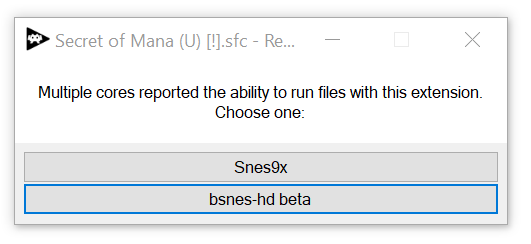

# Retroloader

### Game loader/core auto-selector for Retroarch

Retroloader is a simple single-EXE game loader for Retroarch on Windows. It can be set as the default program for file extensions such as .sfc, .gba, and .iso. When a such a file is launched with Retroloader, it will determine whether any installed Retroarch cores support the file and prompt the user to choose which should be loaded. (If only one core supports files with that extension, it will be loaded without prompting.)

Retroloader _only supports extensions included in the core info files_ included with Retroarch, located in the `Retroarch\info` folder. You may need to download these files from the Retroarch auto-updater.

#### To build:

1.  Follow regular Visual Studio build procedures for a simple Windows Forms C# application.

#### To install:

1.  Place `retroloader.exe` next to `retroarch.exe`.
2.  Right click a file with an extension you'd like to associate with Retroarch, choose Open With, Choose Another App, and select Retroloader.

Retroloader is released under the GNU GPLv3.
